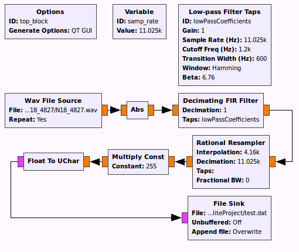

APT Decoder
===============

This is a proof-of-concept APT Decoder made in Javascript.
To run it have `npm`, `nodejs` installed and run:

```bash
npm install
sudo npm install -g bower
sudo npm install -g grunt-cli
bower install
grunt dev
```

The [N18_4827.wav](N18_4827.wav) was recorded by the **WXSat Senior Design Team** at the **University of Kansas** in **Spring 2006**. The copyright of the file belongs to them. See [N18_4827_readme.txt](N18_4827_readme.txt) for more details.

How it Works
============

There is a included [GNU Radio](http://gnuradio.org) called `decoder.grc` that gets a FM Demodulated **wav** audio file and return a unsync'ed data stream (RAW Grayscale image). Here is the diagram:



Aditionally the javascript code also have a Doppler Effect compensation by using the sync signal to sync the lines. The Sync Signal is basically a 1040Hz Sine that is on each frame line start. I use a correlation filter for finding this Sync and get the lines all aligned.

More details to come in a wiki.